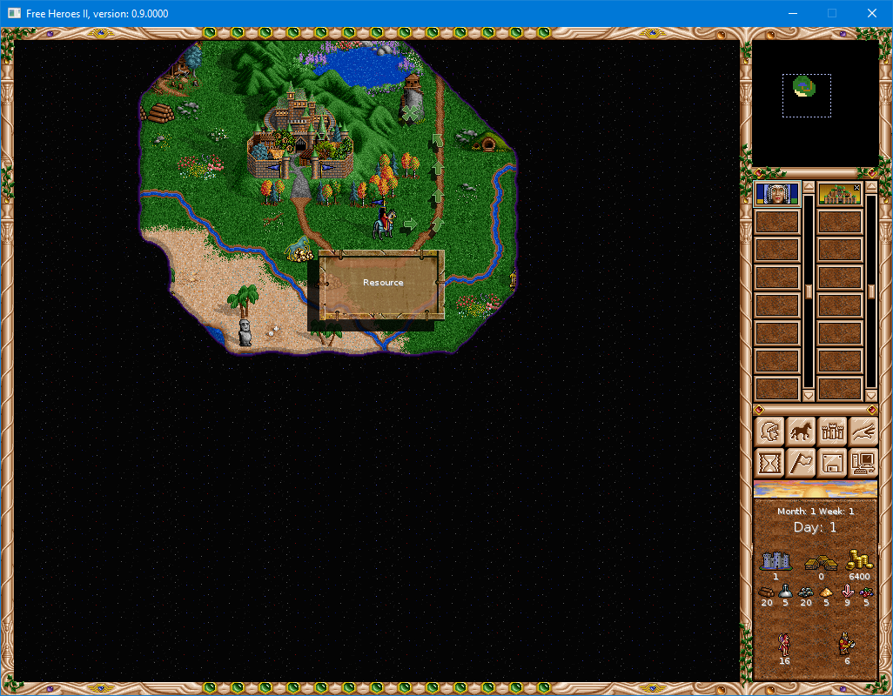
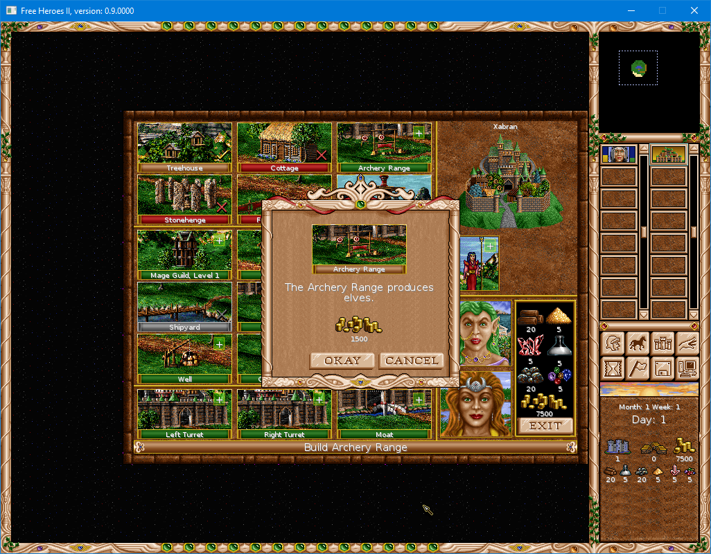

**FHeroes 2 Enhanced**

*What is it?*

Free Heroes 2 is an engine recreation of game Heroes 2 (of Might and Magic) with UI and coding enhancements.

***Work is suspended***

Some people notice that issues are untouched and sadly they will remain as such. As for now, I have lost the interest to strongly go into code and fix issues, for various reasons, including a heavier setup. Though I will not close it, as people can contribute simple fixes as PRs and if they kind of work on my machine, I will incorporate and make a new release.

Now I am trying to redo the game in Java (basically a port of C++ code, but with some easier to debug/contribute, and it will run eventually on a Mac!, 4K screens, it supports 2X and 4X scaling) using JavaFX.

If you are interested into contributing and make Free Heroes 2 "Great again" (sorry, I dislike some guy making things great again), and you like a modern up-to-date Java (meaning you can use "var" keyword, enhanced switch, etc), a full map loading is working with game that supports multiple scalings and a working game on Linux/Windows/Mac (it should work even on Mac/Big Sur). I didn't try it on R-Pi, but it should work on a R-Pi3 or alike with a modern OpenJDK install

https://github.com/ciplogic/TilePainter

**Version 1.0 was launched!**


*Download (on Windows)*


Releases are here:

https://github.com/ciplogic/fheroes2enh/releases/

You can also install it via Chocolatey:
```
choco install fheroes2enh --version 1.1.0
```


*What do you mean by enhancements?*

Features:
* Buying buildings with one click?
* Upgrade units with one click if you have resources
* Last saved file is put on top of "Load" list (files are sorted by time, not name)
* An installer that will also download the Heroes 2 Demo or extra maps to not look for them how to copy (only on Windows now)
* Quick combat to avoid tedious battles. If the QuickCombat results are not perfect, you can replay the battle
* Performance improvements over Free Heroes 2. Especially when "end-turn", in my testing is around 3-4 times quicker
* Many UI fixes
* Game balance fixes: going to a boat will not drain all movement points (but it will dran many). This matches more with Heroes 6-7 gameplay, but is nicer like this. The same is with digging for treasures

Screenshots:






If you want to see what is it about, and you have an Windows machine, why not try it?

The Releases page contains the latest version from here:
https://github.com/ciplogic/fheroes2enh/releases

<span style="color:red">**More details**</span>

Over time there will be mostly usability changes and improvements over modernizing the code. (i.e. C++ 11)

You can see a demo of how it runs and how it is enhanced here: (feel free to build it and make a more pleasing intro!)
https://youtu.be/A8KwfSmW0G4

For now CMake is supported with Linux/Mac OS X only, but please help us to move the code to other platforms (MacOS, Windows and not only).

The editor will not be the target of this project.

**How to start?**

Identify your operating system and if is not Windows do the following: 

*Building on MacOS/Linux*


Install: 
- CMake

- C++ compiler

- SDL 1.2 Development package for SDL itself, SDL_Image, SDL_ttf, SDL_Mixer

- install an IDE of choice: like the excellent CLion from Jetbrains or 
a Makefile based IDE: Eclipse, NetBeans with C++ support and so on.

- download a copy of Heroes 2 Demo or make a copy of the original GoG excellent
Heroes 2 game.

- Clone this repository to a location. Make sure you work against master 
(or develop branch) to not be too late into development.

Copy the content of Heroes 2 Demo or Heroes 2 (especially the folders as DATA or MAPS)
into your source folder


Building the code:

- if you use CLion: chose CMakeLists.txt from the current folder, wait till the 
project is parsed by the IDE and click build

- if you use a Makefile based IDE which doesn't understand CMake: do run the command - 'cmake .' 
(run cmake in current directory) then you should be able to import the makefile in Eclipse CDT 
or any other tool

At the end of building, you should find *fheroes2* binary in the **cmake-build-*target*** folder. 
By default, the Release build uses **LTO** which can take some time on lower spec machines.


*Building on Windows*

Windows support will be always a secondary target from the point of the 
project but if you feel like supporting the Windows build, especially to integrate nicely 
with CMake, we will be able to make it work with you.

The long-story short is:

- install Visual Studio 2017 Community. It is free from Microsoft.

- install SDL development tools

- make a copy of the Git cloned folder into: C:\Cs-oss\FHeroes2Enh

- download your Heroes 2 installation (or Heroes 2 Demo installation) files into
C:\Cs-Oss\FHeroes2Enh

- Build it and it should run (at least on Debug configuration)

**How to contribute**

Things to do:
1. Play the game and promote it if you like it!
2. Fix things that are annoying to you. Don't go to a big item. 
   To do: 
    
    - make a simpler code to read settings (the code is really bad)

    - improve battle's AI with one item at a time: make for example that black dragons will try to attack most enemies units if are two in lines (the same is with Phoenixes)
    
    - improve AI one item at a time: AI should attack troops when it is very likely it cannot lose troops (let's say the life of the hero stacks is 5x bigger than the estimated target troop)

    - improve displaying of popups: provide "trivial/easy/medium/hard/very hard/impossible" ratings to enemy troops
    
    - improve the way a dialog is written
    
    - delete code that is not used
    
    - rewrite code hard to understand to an easier code

  Don't:
    
    - rewrite the AI fully, this is a 1 year task to be done well enough
    
    - rewrite dialogs to use an XML representation (or Json)
    
    - rewrite code to use Qt/Gtk/whatever framework you love best

    When you see big rewrites, don't do them: they are very risky

